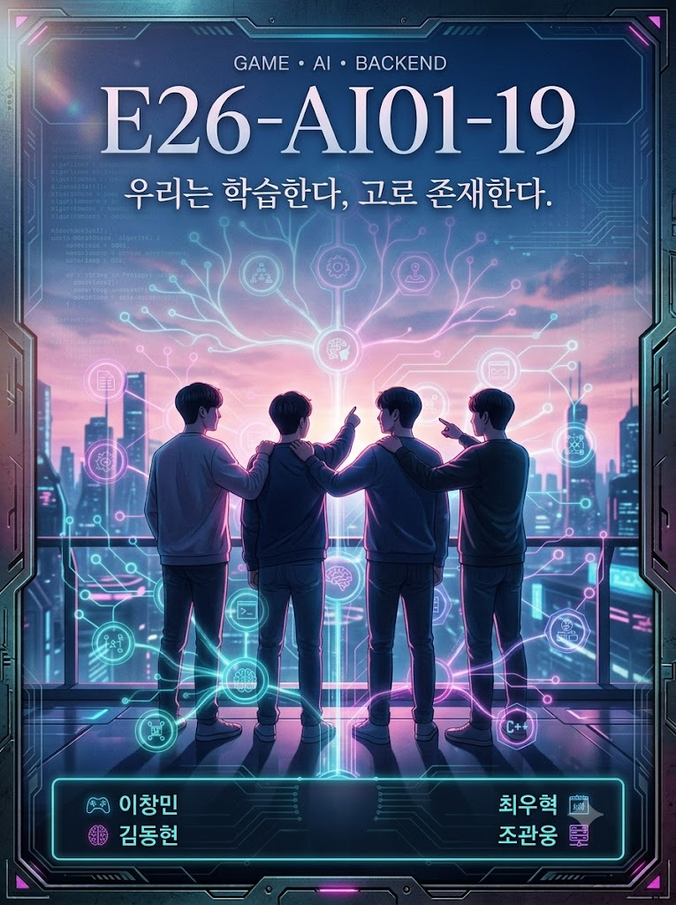

# Welcome to E26-AI01-19

## 🎯 팀 슬로건

> 우리는 학습한다, 고로 존재한다.
> (We learn, therefore we exist.)

데카르트의 명언을 AI 및 개발 관점으로 재해석하여, 멈추지 않는 지속적인 데이터 학습과 기술적 성장을 통해 존재 가치를 증명해 나가는 E26-AI01-19 팀입니다.

## 🖼️ 팀 포스터

<div class="poster"></div>

***

## 1️⃣ 팀원 소개

| **이름** | **전공** | **관심사** |
| --- | --- | --- |
| **이창민** | 인공지능전공 | 게임개발, 인공지능, 프론트엔드, 백엔드 |
| **김동현** | 인공지능전공 | 게임개발, 백엔드 |
| **최우혁** | 인공지능전공 | 백엔드. 인공지능 |
| **조관웅** | 인공지능전공 | 모바일 앱, 게임개발, 인공지능 |


### 팀 소개

**💡 팀 정체성 & 핵심 방향성**

우리는 AI 기술, 안정적인 백엔드 시스템, 그리고 몰입감 넘치는 게임 개발의 유기적인 결합을 지향합니다.

- **AI x Game**: 인공지능 알고리즘을 게임 로직 및 지능형 NPC/월드에 이식하여 한 차원 높은 게임 경험을 창조합니다.
- **Backend x Scale**: AI 모델과 게임 서버를 안정적이고 효율적으로 지탱하는 백엔드 아키텍처를 설계합니다.
- **Continuous Learning**: 끊임없이 변화하는 기술 트렌드 속에서 팀원 모두가 끊임없이 배우고(Train), 검증하며(Validate), 더 높은 성능(Optimize)을 향해 나아갑니다.

***

## 2️⃣ 공통된 관심사 : 게임, 인공지능, 백엔드

***

## 3️⃣ 한학기 동안의 활동 내역 

- 기관/부서 인터뷰 ✔️  

- 현장 탐방 ✔️  

- 멘토링 ✔️  
  - 내 지도 교수 함게 만나기
  - 대학원 방문 및 선배 만나기

- 프로젝트 진행 ✔️  
  - 과거에 사람들이 상상한 미래
  - 그들이 만들어가는 세상
  - 우리가 상상한 미래
  - 우리가 그리는 미래 그리고 나

- 각오와 소감 나누기 ✔️  


<!-- 활동 사진 추가 예시 -->


***

## 4️⃣ 인상 깊은 활동

- 활동명 – 활동에 대한 간단한 설명과 배운 점을 작성  
- 예: 멘토링에서 실리콘밸리 현업 경험을 들을 수 있어 진로 방향 설정에 큰 도움이 되었다.  

***

## 5️⃣ 특별히 알아보고 싶은 것
- 예: 현장실습 제도
- 예: 학부 졸업 인증 조건
- 예: 성취기반평가
- 예: 졸업 후 진로(대학원/취업)

***

## 6️⃣ 활동을 마친 소감

🔗학번 이름  
> "소감 내용을 여기에 작성합니다."

🔗학번 이름  
> "소감 내용을 여기에 작성합니다."

🔗학번 이름  
> "소감 내용을 여기에 작성합니다."

🔗학번 이름  
> "소감 내용을 여기에 작성합니다."

🔗학번 이름  
> "소감 내용을 여기에 작성합니다."


## Markdown을 사용하여 내용꾸미기를 익히세요.

Markdown은 작문을 스타일링하기위한 가볍고 사용하기 쉬운 구문입니다. 여기에는 다음을위한 규칙이 포함됩니다.

```markdown
Syntax highlighted code block

# Header 1
## Header 2
### Header 3

- Bulleted
- List

1. Numbered
2. List

**Bold** and _Italic_ and `Code` text

[Link](url) and 
```

자세한 내용은 [GitHub Flavored Markdown](https://guides.github.com/features/mastering-markdown/).

### Support or Contact

readme 파일 생성에 추가적인 도움이 필요하면 [도움말](https://help.github.com/articles/about-readmes/) 이나 [contact support](https://github.com/contact) 을 이용하세요.

