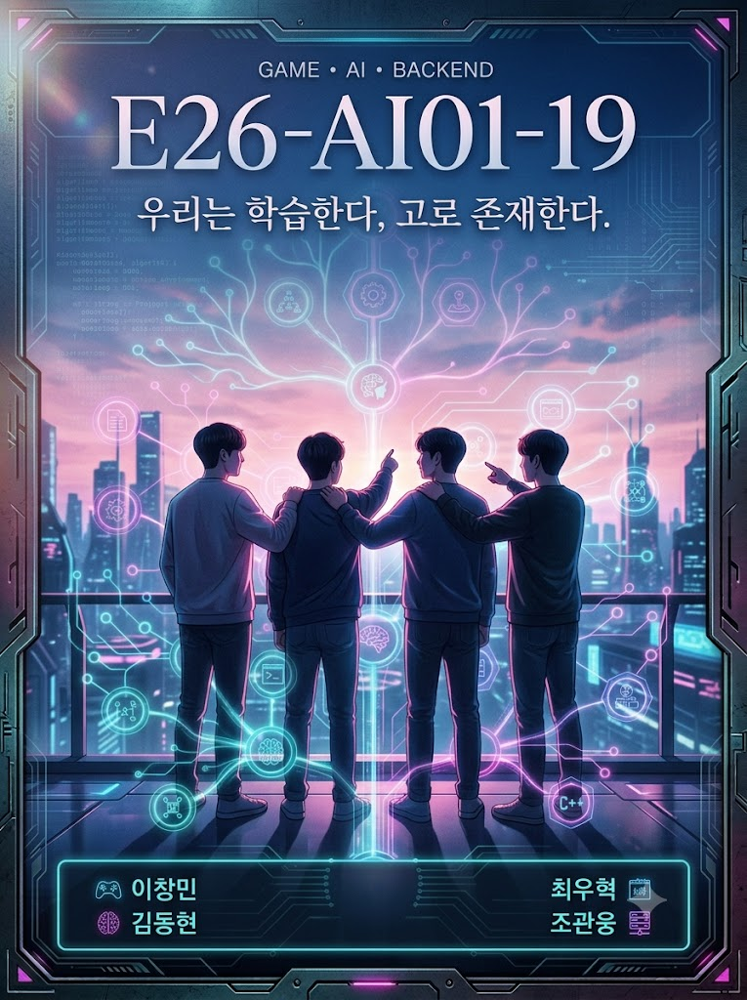

# Welcome to E26-AI01-19

## 🎯 팀 슬로건

> 우리는 학습한다, 고로 존재한다.
> (We learn, therefore we exist.)

데카르트의 명언을 AI 및 개발 관점으로 재해석하여, 멈추지 않는 지속적인 데이터 학습과 기술적 성장을 통해 존재 가치를 증명해 나가는 E26-AI01-19 팀입니다.

## 🖼️ 팀 포스터

<div class="poster"></div>

***

## 1️⃣ 팀원 소개

| **이름** | **전공** | **관심사** |
| --- | --- | --- |
| **이창민** | 인공지능전공 | 게임개발, 인공지능, 프론트엔드, 백엔드 |
| **김동현** | 인공지능전공 | 게임개발, 백엔드 |
| **최우혁** | 인공지능전공 | 백엔드. 인공지능 |
| **조관웅** | 인공지능전공 | 모바일 앱, 게임개발, 인공지능 |


### 팀 소개

**💡 팀 정체성 & 핵심 방향성**

우리는 AI 기술, 안정적인 백엔드 시스템, 그리고 몰입감 넘치는 게임 개발의 유기적인 결합을 지향합니다.

- **AI x Game**: 인공지능 알고리즘을 게임 로직 및 지능형 NPC/월드에 이식하여 한 차원 높은 게임 경험을 창조합니다.
- **Backend x Scale**: AI 모델과 게임 서버를 안정적이고 효율적으로 지탱하는 백엔드 아키텍처를 설계합니다.
- **Continuous Learning**: 끊임없이 변화하는 기술 트렌드 속에서 팀원 모두가 끊임없이 배우고(Train), 검증하며(Validate), 더 높은 성능(Optimize)을 향해 나아갑니다.

***

## 2️⃣ 공통된 관심사 : 게임, 인공지능, 백엔드

***

## 3️⃣ 한학기 동안의 활동 내역 

- 기관/부서 인터뷰 ✔️  

- 현장 탐방 ✔️  

- 멘토링 ✔️  
  - 내 지도 교수 함게 만나기
  - 대학원 방문 및 선배 만나기

- 프로젝트 진행 ✔️  
  - 과거에 사람들이 상상한 미래
  - 그들이 만들어가는 세상
  - 우리가 상상한 미래 (학식 실시간 대기·재고 확인 서비스)
  - 우리가 그리는 미래 그리고 나

- 각오와 소감 나누기 ✔️  

#### 📌 과거에 사람들이 상상한 미래 — 미션 1

과거에 사람들이 상상했던 미래 기술이 현재 얼마나 실현되었는지 조사했습니다.

| 상상한 미래 | 실현 여부 | 설명 |
| --- | --- | --- |
| 달나라 여행 | 일부 실현 | 기술적으로 가능하나 비용이 너무 비쌈 |
| 로봇 청소 | 실현 | 이미 로봇청소기가 상용화되어 일상생활에서 사용 중 |
| 전기자동차 | 실현 | 테슬라 같은 전기자동차가 상용화되어 일상생활에서 사용 중 |
| 자율주행자동차 | 일부 실현 | 기술적으로 가능하나 법적으로 문제가 있음 |
| 소형 TV | 방향 전환 | 따로 소형 TV가 생긴 것이 아니라, 소형 컴퓨터인 스마트폰으로 다양한 것을 해결 |
| 집에서 치료 | 미실현 | 인프라도 구축이 안 되어 있고 기술적으로 아직 구현이 어려우며 법적으로도 문제가 있음 |

#### 📌 미션 2 — 자율주행자동차 심화 분석

위 조사 중 **자율주행자동차**를 주제로 선정하여 WHY-WHAT-HOW-NEXT 관점에서 더 깊이 분석했습니다.

- **WHY (왜 필요한가)**: 운전 피로감 해결, 안정성 향상, 편리성 증대
- **WHAT (무엇인가)**: AI가 자동차에 달린 카메라와 센서를 활용해 스스로 판단하고 운전하는 기술. 모든 자동차가 자율주행 자동차가 되는 것이 꿈꾸는 미래
- **HOW (어떻게 구현하는가)**: 주변 환경 인지 기술, 고정밀 측위 및 지도 기술, 상황 판단 및 경로 계획 기술, 주행 제어 기술, 통신 기술이 필요하며, 아직 법적·기타 문제로 인해 완벽한 자율주행은 구현되지 않음
- **NEXT (앞으로의 과제)**: 갑작스러운 변수에 대처할 수 있는 기술이 부족하고, 사고 발생 시 책임 소재를 가리는 법적 문제가 해결되어야 함

#### 📌 미션 3 — 우리가 상상한 미래: 학식 실시간 대기·재고 확인 서비스

학교생활 속 불편함에서 출발해, AI와 함께 문제를 정의하고 해결 방향을 도출했습니다.

**STEP 01. 문제 정의 (핵심 1문장)**

> 학생들은 점심시간에 학식당 줄이 얼마나 긴지, 먹으려는 메뉴가 남아있는지 직접 가보기 전에는 알 수 없어 대기 시간을 낭비하고 품절로 헛걸음을 한다.

**STEP 02. AI와 소통한 주요 프롬프트**

1. "대학교 학식당 이용자의 불편함을 사용자 입장에서 정리해줘."
2. "학식 줄 길이와 예상 대기시간을 온라인으로 보여주려면 어떤 데이터를 어떻게 모을 수 있을까?"
3. "메뉴별 남은 재고를 실시간으로 알려주는 방법을 비용이 적게 드는 순서로 제안해줘."
4. "학생들이 설치 없이 바로 쓸 수 있는 서비스 화면 구성을 제안해줘."

**STEP 03. AI 제안 내용 요약**

| 구분 | AI 제안 |
| --- | --- |
| 줄 길이 측정 | CCTV/카메라 인원 인식, 출입구 센서, 와이파이 접속자 수, 식권 키오스크 판매 데이터 |
| 예상 대기시간 | 대기 인원 × 1인당 평균 배식 시간으로 계산 |
| 메뉴 재고 | 준비 수량 − 키오스크 판매 수량으로 실시간 계산 |
| 전달 방식 | 모바일 앱, 웹페이지, 카카오톡 채널, 품절 임박 푸시 알림 |

**STEP 04. 팀의 수정 및 검토 내용**

- **카메라 방식 제외**: 개인정보 문제와 설치 비용을 고려해, 이미 존재하는 **키오스크 판매 데이터**를 활용하기로 결정
- **대기시간은 범위로 표시**: 정확한 분 단위 대신 "약 5~10분"처럼 보여주어 오차 부담을 줄임
- **재고는 3단계 상태로 표시**: 정확한 수량 대신 🟢여유 / 🟡임박 / 🔴품절로 직관적으로 표현
- **앱 대신 웹페이지**: 설치 없이 QR·링크로 바로 접속할 수 있도록 하여 이용 장벽을 낮춤

**STEP 05. 선택한 방향 및 다음 질문**

- **선택한 방향**: 키오스크 판매 데이터를 기반으로 식당별 예상 대기시간과 메뉴별 재고 상태(여유/임박/품절)를 보여주는 모바일 웹 서비스
- **다음 질문**
  - 학교·식당 운영 측으로부터 키오스크 데이터를 제공받을 수 있을까?
  - 키오스크 결제 없이 줄만 서 있는 인원은 어떻게 반영할까?
  - 실제 대기시간과 예측값의 차이를 어떻게 검증할까?

**OPTIONAL. 미래 서비스 콘셉트**

- 스마트폰 화면 상단: `한울식당 · 예상 대기 약 7분 · 대기 23명`
- 하단: 메뉴 카드 목록 (돈까스 🟢여유 / 제육덮밥 🟡임박 / 비빔밥 🔴품절)
- 품절 임박 메뉴에 "알림 받기" 버튼 제공

**🎤 사람이 결정한 부분은 무엇인가?**

> AI는 카메라 인식, 센서, 앱 등 다양한 방법을 제안했지만, **카메라 대신 키오스크 데이터를 쓰기로 한 것**, **정확한 수치 대신 범위와 3단계 상태로 보여주기로 한 것**, **앱이 아닌 웹으로 제공하기로 한 것**은 개인정보·비용·사용성을 고려해 팀이 직접 판단했습니다.


<!-- 활동 사진 추가 예시 -->


***

## 4️⃣ 인상 깊은 활동

- 활동명 – 활동에 대한 간단한 설명과 배운 점을 작성  
- 예: 멘토링에서 실리콘밸리 현업 경험을 들을 수 있어 진로 방향 설정에 큰 도움이 되었다.  

***

## 5️⃣ 특별히 알아보고 싶은 것
- 예: 현장실습 제도
- 예: 학부 졸업 인증 조건
- 예: 성취기반평가
- 예: 졸업 후 진로(대학원/취업)

***

## 6️⃣ 활동을 마친 소감

🔗학번 이름  
> "소감 내용을 여기에 작성합니다."

🔗학번 이름  
> "소감 내용을 여기에 작성합니다."

🔗학번 이름  
> "소감 내용을 여기에 작성합니다."

🔗학번 이름  
> "소감 내용을 여기에 작성합니다."

🔗학번 이름  
> "소감 내용을 여기에 작성합니다."


## Markdown을 사용하여 내용꾸미기를 익히세요.

Markdown은 작문을 스타일링하기위한 가볍고 사용하기 쉬운 구문입니다. 여기에는 다음을위한 규칙이 포함됩니다.

```markdown
Syntax highlighted code block

# Header 1
## Header 2
### Header 3

- Bulleted
- List

1. Numbered
2. List

**Bold** and _Italic_ and `Code` text

[Link](url) and 
```

자세한 내용은 [GitHub Flavored Markdown](https://guides.github.com/features/mastering-markdown/).

### Support or Contact

readme 파일 생성에 추가적인 도움이 필요하면 [도움말](https://help.github.com/articles/about-readmes/) 이나 [contact support](https://github.com/contact) 을 이용하세요.

